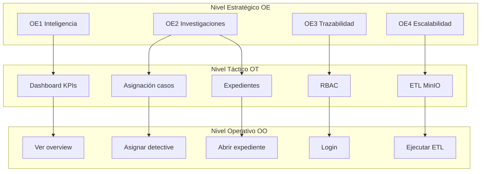

# 6. Documentación organizacional y alineación del sistema — CrimeTrack Analytics Corp

**Sistema:** CrimeTrack Analytics Corp  
**Documentos relacionados:** `08_casos_de_uso_historias.md`, `10_estructura_paquetes.md`

---

## 6.1 Descripción de la empresa

**CrimeTrack Analytics Corp** es una unidad de **inteligencia criminal y apoyo a la toma de decisiones** en seguridad pública. Su propósito es convertir registros delictivos dispersos — hechos en calle, expedientes, personas involucradas y evidencias — en **información confiable, oportuna y accionable** para mandos, investigadores y analistas.

La organización opera bajo un modelo de **datos como activo estratégico**: los hechos crudos se ingieren en capa operativa (PocketBase), se transforman a modelo dimensional (estrella) y se publican en un **Data Lake analítico** (MinIO/Parquet) para consultas masivas sin afectar la operación diaria.

**Áreas funcionales que la empresa representa en este proyecto:**


| Área                       | Rol en la organización                                                      |
| -------------------------- | --------------------------------------------------------------------------- |
| Mando / Comisaría          | Priorización de casos, asignación de detectives, supervisión de avance      |
| Investigación criminal     | Gestión de expedientes, involucrados, evidencias y bitácora de progreso     |
| Analítica e inteligencia   | Dashboards, KPIs, tendencias y rankings por distrito/tipo/año               |
| Administración de sistemas | Usuarios, permisos, respaldos, políticas de seguridad, estado de servicios  |
| Ingeniería de datos        | ETL PocketBase → MinIO, materialización de resúmenes, jobs en segundo plano |


**Stack tecnológico (contexto del sistema):** React (UI), Django (API), PocketBase (OLTP), MinIO (OLAP + evidencias), Redis/Celery (tareas asíncronas), Docker (despliegue).

---

## 6.2 Visión

> Ser la **plataforma de referencia** en analítica criminal integrada, donde cada registro —desde el hecho en calle hasta la dimensión estratégica— alimenta un ecosistema único: **operación ágil (PocketBase + expedientes)** y **analítica escalable (MinIO/Parquet)**, maximizando la efectividad policial y la confianza institucional con los recursos disponibles.

---

## 6.3 Misión

> **Transformar datos criminales en conocimiento confiable y oportuno** para que comisarios, detectives y analistas reduzcan incertidumbre, prioricen intervenciones, gestionen investigaciones con trazabilidad y protejan a la comunidad con decisiones basadas en evidencia.

---

## 6.4 Niveles de objetivo y su reflejo en el sistema


| Nivel                | Qué define                                                  | Cómo se refleja en CrimeTrack                                                       |
| -------------------- | ----------------------------------------------------------- | ----------------------------------------------------------------------------------- |
| **Estratégico (OE)** | Metas generales de la organización a mediano/largo plazo    | Funcionalidades transversales: dashboard ejecutivo, OLTP/OLAP, RBAC, respaldos, ETL |
| **Táctico (OT)**     | Necesidades de áreas o departamentos (mando, analítica, TI) | Módulos por paquete: asignación, expedientes, administración, analítica             |
| **Operativo (OO)**   | Actividades diarias de usuarios finales                     | Formularios, consultas, asignaciones, bitácora, carga de evidencias                 |
| **Meta**             | Resultado medible y acotado en el tiempo                    | KPI asociado a cada OO (porcentaje, tiempo, conteo, tasa)                           |


### Jerarquía de descomposición

```text
1 OE  ──►  varios OT  ──►  varios OO  ──►  varias METAS
(Estratégico)   (Táctico)     (Operativo)    (Indicadores)
```

**Regla de trazabilidad:** toda funcionalidad del sistema debe poder enlazarse con al menos un OO, que a su vez apoya un OT y contribuye a un OE.

---

## 6.5 Definición de cada nivel

### Objetivo Estratégico (OE)

Define **hacia dónde** quiere llegar la organización en términos de capacidad institucional (inteligencia, eficiencia, calidad de datos, resiliencia). No describe tareas diarias; orienta inversiones, políticas y arquitectura del sistema.

### Objetivo Táctico (OT)

Traduce un OE en **necesidades de área**: qué debe poder hacer el Comisario, el área de analítica o TI para cumplir la estrategia. En CrimeTrack se materializa como **paquetes o módulos** (dashboard, asignaciones, expedientes, administración).

### Objetivo Operativo (OO)

Describe **acciones concretas** que ejecuta un actor en su jornada: asignar un detective, consultar un expediente, subir evidencia, registrar avance. Se implementa como **pantallas, APIs y procesos** del sistema.

### Meta

Es el **resultado cuantificable** de cumplir un OO (KPI). Permite verificar si el sistema está aportando valor (ej.: reducir tiempo de consulta, aumentar casos con detective asignado, % de respaldos exitosos).

---

## 6.6 Mapa de objetivos (resumen jerárquico)


| OE                                                                     | OT                                          | OO (ejemplos)                                    | Metas (ejemplos)                               |
| ---------------------------------------------------------------------- | ------------------------------------------- | ------------------------------------------------ | ---------------------------------------------- |
| **OE1** Fortalecer inteligencia criminal para decisiones estratégicas  | OT1.1 Monitorear KPIs ejecutivos            | OO1.1.1 Consultar dashboard                      | M1.1.1 Tiempo de carga dashboard < 2 s         |
|                                                                        | OT1.2 Analizar tendencias delictivas        | OO1.2.1 Filtrar hechos por distrito/tipo         | M1.2.1 Consultas analíticas sin bloquear UI    |
|                                                                        |                                             | OO1.2.2 Revisar ranking de detectives            | M1.2.2 Ranking actualizado tras ETL            |
| **OE2** Optimizar gestión operativa de investigaciones                 | OT2.1 Asignar y balancear carga             | OO2.1.1 Consultar detectives disponibles         | M2.1.1 100% asignaciones con fecha registrada  |
|                                                                        |                                             | OO2.1.2 Asignar / reasignar / remover detective  | M2.1.2 Notificación al detective en < 1 min    |
|                                                                        | OT2.2 Supervisar progreso                   | OO2.2.1 Consultar progreso de investigaciones    | M2.2.1 Comisario ve todos los casos activos    |
|                                                                        | OT2.3 Gestionar expedientes                 | OO2.3.1 Abrir detalle de expediente              | M2.3.1 Detalle carga sin escanear 300k filas   |
|                                                                        |                                             | OO2.3.2 Registrar bitácora y % avance            | M2.3.2 Actualización de estado en dim_caso     |
| **OE3** Garantizar calidad, trazabilidad y seguridad de la información | OT3.1 Control de acceso                     | OO3.1.1 Iniciar sesión con RBAC                  | M3.1.1 0 accesos no autorizados a expedientes  |
|                                                                        |                                             | OO3.1.2 Gestionar usuarios y permisos            | M3.1.2 Roles alineados a funciones             |
|                                                                        | OT3.2 Custodia de evidencias e involucrados | OO3.2.1 Registrar involucrados                   | M3.2.1 Trazabilidad víctima/testigo/sospechoso |
|                                                                        |                                             | OO3.2.2 Subir evidencia a MinIO                  | M3.2.2 100% evidencias con URL y custodia      |
|                                                                        | OT3.3 Auditoría                             | OO3.3.1 Registrar acciones en bitácora/audit log | M3.3.1 Log por asignación y cambio de estado   |
| **OE4** Escalar analítica sin degradar operación                       | OT4.1 Pipeline ETL                          | OO4.1.1 Ejecutar ETL PB → MinIO                  | M4.1.1 ETL 100k+ registros sin bloquear HTTP   |
|                                                                        |                                             | OO4.1.2 Materializar resumen dashboard           | M4.1.2 Dashboard sin consultar PocketBase      |
|                                                                        | OT4.2 Respaldo y recuperación               | OO4.2.1 Programar respaldo completo              | M4.2.1 RPO ≤ 24 h; restore con capa analítica  |
|                                                                        |                                             | OO4.2.2 Restaurar desde ZIP                      | M4.2.2 Skip ETL si ZIP trae `analitica/`       |


---

## 6.7 Alineación pormenorizada: sistema ↔ objetivos organizacionales

Tabla maestra (formato académico solicitado). Cada fila es trazable: **OE → OT → OO → Proceso → Funcionalidad → KPI → Caso de uso**.

### OE1 — Fortalecer la inteligencia criminal para decisiones estratégicas


| OE  | OT                               | OO                                        | Proceso que apoya el sistema      | Funcionalidad del sistema                                                                                                  | KPI                                                      | Caso de uso                                                             |
| --- | -------------------------------- | ----------------------------------------- | --------------------------------- | -------------------------------------------------------------------------------------------------------------------------- | -------------------------------------------------------- | ----------------------------------------------------------------------- |
| OE1 | OT1.1 Monitorear KPIs ejecutivos | OO1.1.1 Consultar indicadores agregados   | Inteligencia criminal — monitoreo | Dashboard materializado (`app_dashboard_summary`); `GET /api/packages/dashboard-analitica/overview/`; lectura DuckDB/MinIO | Tiempo de respuesta overview < 2 s; disponibilidad ≥ 99% | **Actor:** Comisario / Analista · **CU:** Consultar dashboard ejecutivo |
| OE1 | OT1.1                            | OO1.1.2 Revisar distribución por distrito | Análisis territorial              | Gráfico crimes-by-district; agregaciones OLAP                                                                              | % decisiones de despliegue apoyadas en dashboard         | **Actor:** Comisario · **CU:** Consultar delitos por distrito           |
| OE1 | OT1.2 Analizar tendencias        | OO1.2.1 Explorar series temporales        | Análisis de tendencias            | KPIs por año en resumen; filtros en capa analítica                                                                         | Reducción tiempo de análisis manual (horas → minutos)    | **Actor:** Analista Criminal · **CU:** Analizar tendencias delictivas   |
| OE1 | OT1.2                            | OO1.2.2 Evaluar desempeño investigativo   | Evaluación de recursos            | Ranking detectives (`detective_ranking`); casos asignados vs resueltos                                                     | Tasa resolución por detective visible en dashboard       | **Actor:** Comisario · **CU:** Consultar ranking de detectives          |


### OE2 — Optimizar la gestión operativa de investigaciones


| OE  | OT                              | OO                                         | Proceso que apoya el sistema       | Funcionalidad del sistema                                                                  | KPI                                                   | Caso de uso                                                        |
| --- | ------------------------------- | ------------------------------------------ | ---------------------------------- | ------------------------------------------------------------------------------------------ | ----------------------------------------------------- | ------------------------------------------------------------------ |
| OE2 | OT2.1 Asignar y balancear carga | OO2.1.1 Consultar carga laboral            | Gestión de recursos humanos        | `GET .../asignacion-investigaciones/detectives-disponibles/`; casos activos por detective  | Detectives bajo umbral de saturación (≤ 15 casos)     | **Actor:** Comisario · **CU:** Consultar detectives disponibles    |
| OE2 | OT2.1                           | OO2.1.2 Asignar detective a caso nuevo     | Delegación formal de investigación | `POST .../asignar/`; registro en `app_asignaciones`; sync `dim_caso.investigador_asignado` | 100% asignaciones con `fecha_asignacion`              | **Actor:** Comisario · **CU:** Asignar detective a caso            |
| OE2 | OT2.1                           | OO2.1.3 Reasignar o remover detective      | Reestructuración de equipo         | `POST .../reasignar/` y `.../remover/`; cierre de asignación activa                        | Tiempo de reasignación < 5 min                        | **Actor:** Comisario · **CU:** Reasignar / Remover detective       |
| OE2 | OT2.2 Supervisar progreso       | OO2.2.1 Consultar avance global            | Supervisión investigativa          | `GET .../progreso/` (Comisario ve todos)                                                   | % casos en estado «En investigación» visible          | **Actor:** Comisario · **CU:** Consultar progreso de investigación |
| OE2 | OT2.2                           | OO2.2.2 Consultar expedientes propios      | Seguimiento operativo              | `GET .../progreso/?mis_casos=1`                                                            | 100% casos asignados listados para el detective       | **Actor:** Detective · **CU:** Ver expedientes asignados           |
| OE2 | OT2.3 Gestionar expediente      | OO2.3.1 Consultar hechos crudos del delito | Investigación — fase inicial       | Tab Detalles Generales; DuckDB sobre `crimes_220k` por `case_number`                       | Consulta expediente < 3 s (sin full scan)             | **Actor:** Detective · **CU:** Consultar detalle Data Lake         |
| OE2 | OT2.3                           | OO2.3.2 Gestionar involucrados             | Cadena de custodia personas        | Tab Involucrados; `app_involucrados` + `app_caso_involucrado`                              | Involucrados tipificados (Víctima/Testigo/Sospechoso) | **Actor:** Detective · **CU:** Registrar involucrado               |
| OE2 | OT2.3                           | OO2.3.3 Custodiar evidencia digital        | Cadena de custodia material        | Tab Evidencias; upload MinIO + `app_evidencias`                                            | 100% archivos con `minio_url` y peso registrado       | **Actor:** Detective · **CU:** Subir evidencia multimedia          |
| OE2 | OT2.3                           | OO2.3.4 Registrar bitácora y avance        | Seguimiento de diligencias         | Tab Bitácora; `app_expediente_bitacora`; slider 0–100%; cambio estado                      | Actualización estado en `dim_caso` por entrada        | **Actor:** Detective · **CU:** Registrar avance investigativo      |


### OE3 — Garantizar calidad, trazabilidad y seguridad de la información


| OE  | OT                        | OO                                                  | Proceso que apoya el sistema   | Funcionalidad del sistema                                   | KPI                                       | Caso de uso                                                     |
| --- | ------------------------- | --------------------------------------------------- | ------------------------------ | ----------------------------------------------------------- | ----------------------------------------- | --------------------------------------------------------------- |
| OE3 | OT3.1 Control de acceso   | OO3.1.1 Autenticarse en la plataforma               | Seguridad lógica               | Login JWT; roles Admin/Comisario/Detective/Analista         | 0 sesiones sin token válido               | **Actor:** Todos · **CU:** Iniciar sesión                       |
| OE3 | OT3.1                     | OO3.1.2 Restringir expediente al detective asignado | Principio de mínimo privilegio | `CanAccessExpedienteJWT`; validación asignación activa      | 0 accesos a expedientes no asignados      | **Actor:** Detective · **CU:** Acceder expediente autorizado    |
| OE3 | OT3.1                     | OO3.1.3 Administrar usuarios y permisos             | Gobierno de identidades        | Módulo Admin usuarios/permisos; `sys_rol_permisos`          | 100% usuarios con rol y permiso explícito | **Actor:** Admin · **CU:** Gestionar usuarios RBAC              |
| OE3 | OT3.2 Integridad del dato | OO3.2.1 Validar datos en ingesta                    | Calidad de datos               | Validación formularios UI; ETL con modelo estrella          | % campos obligatorios completos en dims   | **Actor:** Analista / Admin · **CU:** CRUD dimensiones y hechos |
| OE3 | OT3.3 Auditoría           | OO3.3.1 Trazar asignaciones                         | Auditoría operativa            | `app_audit_logs` en asignar/remover; historial asignaciones | 100% asignaciones auditadas               | **Actor:** Sistema · **CU:** Auditar asignación                 |
| OE3 | OT3.3                     | OO3.3.2 Trazar respaldos fallidos                   | Continuidad operativa          | Alertas respaldo a Comisario; historial respaldos           | MTTR respaldos; alertas en < 15 min       | **Actor:** Comisario · **CU:** Recibir alerta respaldo fallido  |


### OE4 — Escalar analítica y disponibilidad sin degradar operación


| OE  | OT                       | OO                                      | Proceso que apoya el sistema   | Funcionalidad del sistema                                  | KPI                                             | Caso de uso                                                   |
| --- | ------------------------ | --------------------------------------- | ------------------------------ | ---------------------------------------------------------- | ----------------------------------------------- | ------------------------------------------------------------- |
| OE4 | OT4.1 Pipeline analítico | OO4.1.1 Ejecutar ETL a MinIO            | Ingeniería de datos            | `run_etl_pb_to_minio`; Celery/thread; Parquet consolidado  | ETL 100k filas sin timeout HTTP (202 + polling) | **Actor:** Admin / Analista · **CU:** Ejecutar ETL PB → MinIO |
| OE4 | OT4.1                    | OO4.1.2 Refrescar resumen dashboard     | Materialización OLAP           | `refresh_dashboard_summary`; tabla `app_dashboard_summary` | Dashboard sin queries live a PocketBase         | **Actor:** Sistema · **CU:** Materializar resumen dashboard   |
| OE4 | OT4.1                    | OO4.1.3 Generar datos de prueba masivos | Capacitación / carga académica | Faker async; chunks 5.000; PocketBase batch                | 100k registros generados sin bloquear UI        | **Actor:** Admin · **CU:** Generar datos ficticios            |
| OE4 | OT4.2 Resiliencia        | OO4.2.1 Respaldar operación + analítica | Continuidad del negocio        | Backup ZIP con `analitica/` (16 tablas lógicas + star)     | 100% respaldos incluyen capa analítica          | **Actor:** Admin · **CU:** Ejecutar respaldo completo         |
| OE4 | OT4.2                    | OO4.2.2 Restaurar sistema               | Recuperación ante desastres    | Restore pipeline; skip ETL si ZIP trae analítica           | RTO restore acotado; UI progreso por fases      | **Actor:** Admin · **CU:** Restaurar desde backup             |


---

## 6.8 Cómo encaja CrimeTrack en lo que la empresa quiere (síntesis)


| Dimensión organizacional | Qué quiere la empresa               | Cómo lo resuelve CrimeTrack                                     |
| ------------------------ | ----------------------------------- | --------------------------------------------------------------- |
| **Estrategia**           | Decidir con datos, no con intuición | Dashboard materializado, OLAP MinIO, KPIs y rankings            |
| **Táctica**              | Coordinar personas y casos          | Paquete asignación: carga laboral, notificaciones, progreso     |
| **Operación**            | Trabajo diario del detective        | Expediente por tabs: hechos, involucrados, evidencias, bitácora |
| **TI / Datos**           | Escalar sin caídas                  | Split OLTP/OLAP, ETL async, respaldos con analítica embebida    |
| **Cumplimiento**         | Saber quién hizo qué                | RBAC, audit logs, custodia evidencias en MinIO                  |





---

## 6.9 Actores del sistema (roles implementados)


| Actor                 | Nivel predominante  | Paquetes / pantallas principales                                    |
| --------------------- | ------------------- | ------------------------------------------------------------------- |
| **Admin**             | Táctico / soporte   | Administración, respaldos, usuarios, ETL, generación datos          |
| **Comisario**         | Táctico             | Dashboard, asignación detectives, progreso global, alertas respaldo |
| **Detective**         | Operativo           | Mis expedientes, detalle expediente (4 tabs), bitácora              |
| **Analista Criminal** | Táctico / analítico | Dashboard indicadores, CRUD hechos/dimensiones, ETL                 |
| **Oficial**           | Operativo           | Consulta datos raw / hechos (permisos limitados)                    |


---

## 6.10 Metas globales de la organización (indicadores institucionales)


| Meta global                             | OE relacionados | Indicador                                | Contribución del sistema         |
| --------------------------------------- | --------------- | ---------------------------------------- | -------------------------------- |
| M-G1 Reducir tiempo de insight          | OE1, OE4        | Horas de análisis → minutos en dashboard | Materialización + DuckDB         |
| M-G2 Aumentar casos con responsable     | OE2             | % casos con detective asignado           | Módulo asignación + notificación |
| M-G3 Mejorar trazabilidad investigativa | OE2, OE3        | Entradas bitácora por caso / mes         | Tab bitácora + audit log         |
| M-G4 Garantizar continuidad             | OE4             | % respaldos exitosos; RTO restore        | Backup/restore con analítica     |
| M-G5 Proteger información sensible      | OE3             | Incidentes de acceso no autorizado = 0   | JWT + permisos por rol y caso    |


---

*Documento alineado al estado del repositorio CrimeTrack (paquetes implementados: autenticación, administración, dashboard analítica, asignación investigaciones, expedientes criminales). Actualizar al incorporar reportería, auditoría dedicada o involucrados como paquete independiente.*