# 7. Plano funcional del sistema — CrimeTrack Analytics Corp

**Sistema:** CrimeTrack Analytics Corp (plataforma completa)  
**Estándar:** UML 2.x (vistas de contexto, contenedores, componentes, despliegue, dominio y secuencia)  
**Alcance:** Arquitectura objetivo del producto — capas operativa, analítica, presentación y orquestación.

---

## 7.1 Visión general del sistema

CrimeTrack es una **plataforma de analítica criminal** con arquitectura desacoplada:

| Capa | Tecnología | Función |
|------|------------|---------|
| Presentación | React + Vite + Tailwind | Dashboard, CRUD ISO 9241-210 |
| Aplicación | Django REST | Orquestación, reglas de negocio, ETL |
| Operacional (OLTP) | PocketBase | Modelo estrella: 10 dimensiones + `fact_crimes` |
| Analítica / objetos | MinIO (S3) | Data lake Parquet + evidencias multimedia |
| Orquestación | Docker Compose | MinIO + PocketBase en red `crimetrack_net` |
| Legado (externo) | PostgreSQL | Fuente histórica; migración única hacia PocketBase |

Django **no** persiste datos de crímenes en ORM relacional; consume PocketBase por REST.

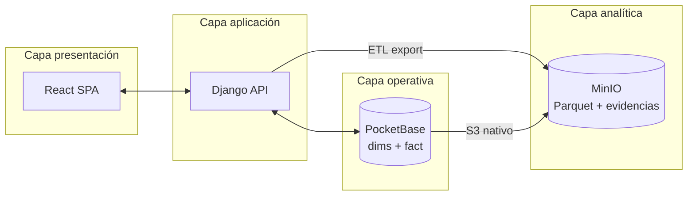

---

## 7.2 Diagrama de contexto del sistema (UML — vista Context)

Representa el sistema **CrimeTrack** como caja negra y sus interacciones con actores y sistemas externos.

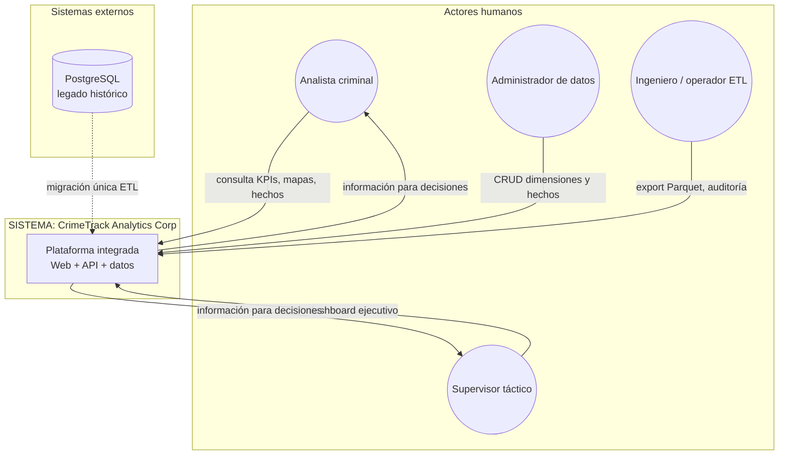

| Interfaz | Descripción |
|----------|-------------|
| UI Web (`:5173`) | Punto único de interacción usuario–sistema |
| API REST (`:8000/api`) | Contrato entre frontend y backend |
| PocketBase (`:8090`) | Persistencia operacional y reglas de colección |
| MinIO (`:9000` / `:9001`) | Almacenamiento objeto S3 (lake + archivos) |

---

## 7.3 Diagrama de contenedores (arquitectura lógica completa)

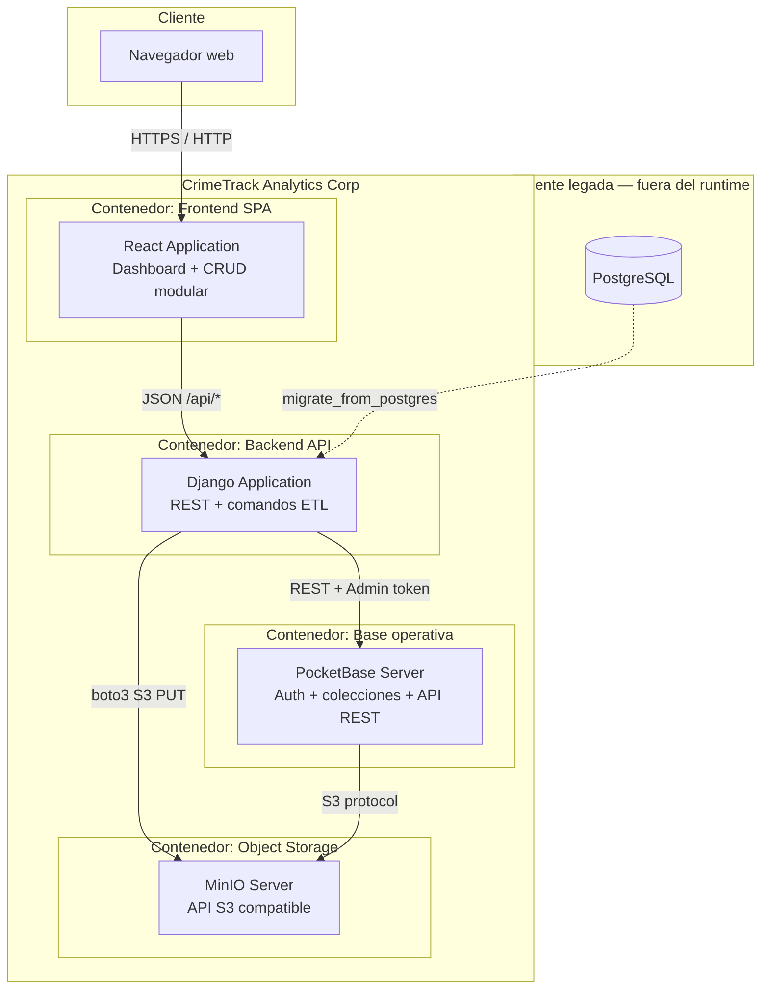

---

## 7.4 Diagrama de componentes (UML — vista Component)

Desglose interno de los contenedores principales.

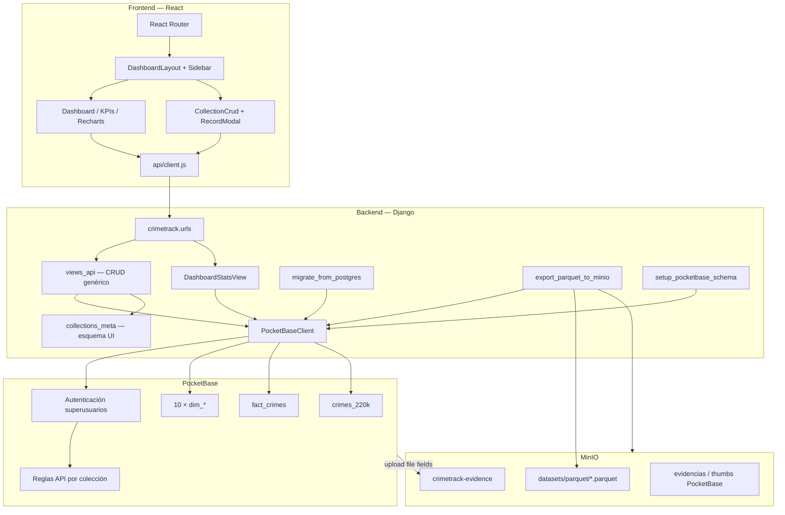

### Inventario de componentes

| Componente | Paquete / ruta | Responsabilidad |
|------------|----------------|-----------------|
| SPA React | `frontend/src/` | Interfaz usuario, usabilidad ISO 9241-210 |
| API REST | `backend_django/core/views_api.py` | Proxy CRUD y estadísticas |
| Cliente PB | `core/services/pocketbase.py` | Integración REST PocketBase |
| Metadatos colecciones | `core/collections_meta.py` | Formularios y menú dinámico |
| ETL legado | `migrate_from_postgres` | Carga inicial desde PostgreSQL |
| ETL analítico | `export_parquet_to_minio` | PB → Parquet → MinIO |
| Bootstrap esquema | `setup_pocketbase_schema` | Creación colecciones dim/fact |
| PocketBase | Docker `:8090` | OLTP, relaciones, ~220k hechos |
| MinIO | Docker `:9000` | Data lake + binarios |

---

## 7.5 Modelo de dominio — modelo estrella (UML — vista de dominio)

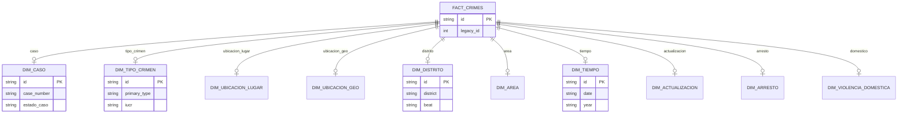

Colección auxiliar `crimes_220k`: vista plana de staging / consulta masiva sin joins.

---

## 7.6 Diagrama de despliegue (UML — vista Deployment)

Despliegue **del sistema CrimeTrack** en entorno de operación (Docker + servicios de aplicación).

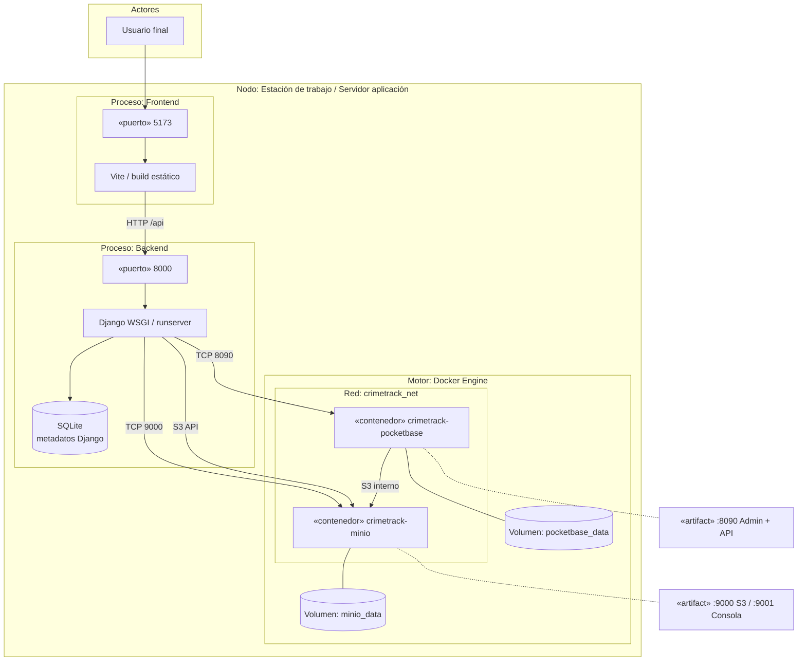

### Artefactos desplegados

| Nodo / artefacto | Puerto | Rol en el sistema |
|------------------|--------|-------------------|
| `crimetrack-minio` | 9000, 9001 | Object storage S3 |
| `crimetrack-pocketbase` | 8090 | Base operativa + API |
| Django | 8000 | API de negocio y ETL |
| React (Vite) | 5173 | Interfaz web |
| `infra/docker-compose.yml` | — | Orquestación contenedores |

---

## 7.7 Diagrama de actividades — pipeline de datos del sistema

Flujo **completo** de información en CrimeTrack (operación + analítica).

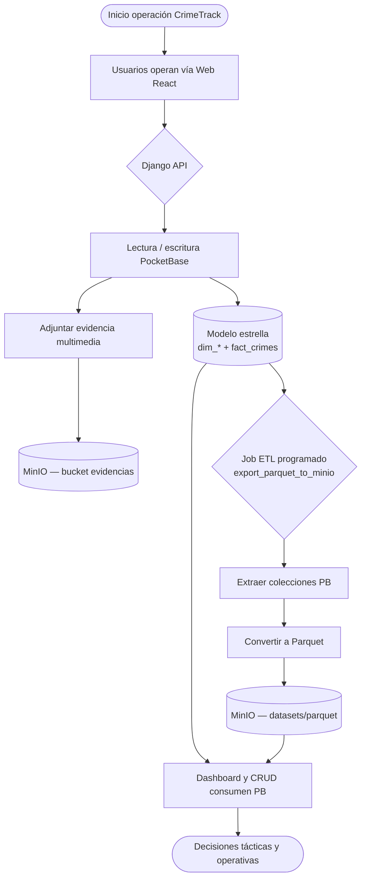

---

## 7.8 Diagramas de secuencia — comportamiento del sistema

### SEC-01 — Consulta de dashboard (operación normal)

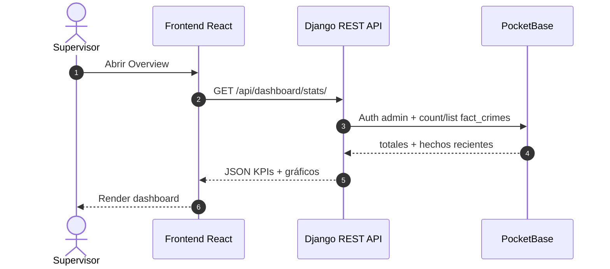

### SEC-02 — CRUD sobre dimensión (gestión maestros)

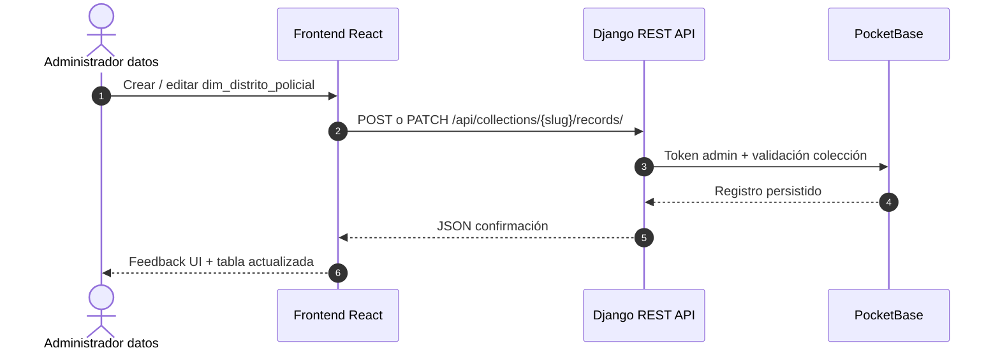

### SEC-03 — CRUD hecho delictivo con relaciones (fact_crimes)

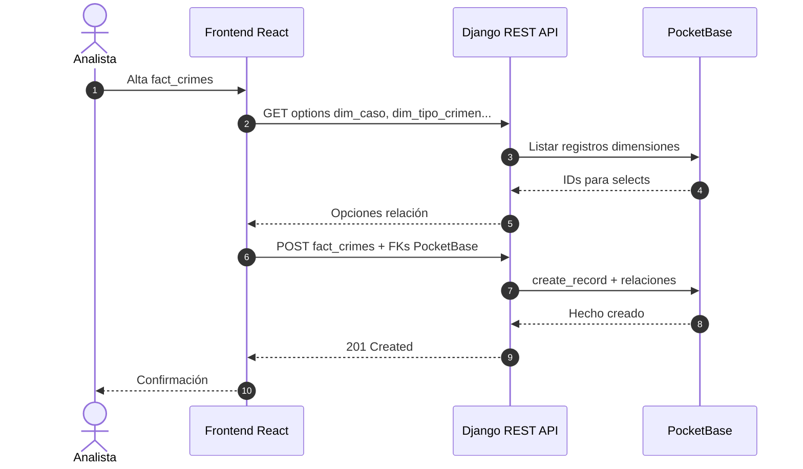

### SEC-04 — Pipeline analítico PocketBase → Parquet → MinIO

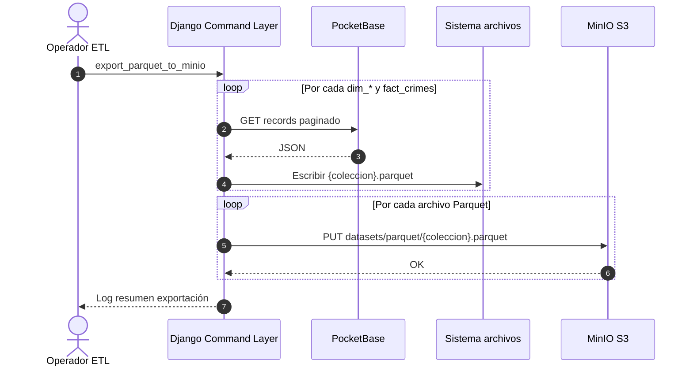

### SEC-05 — Almacenamiento de evidencia multimedia

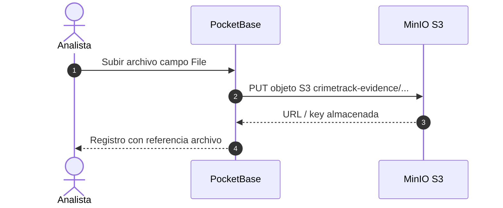

### SEC-06 — Migración legada (proceso de arranque del sistema)

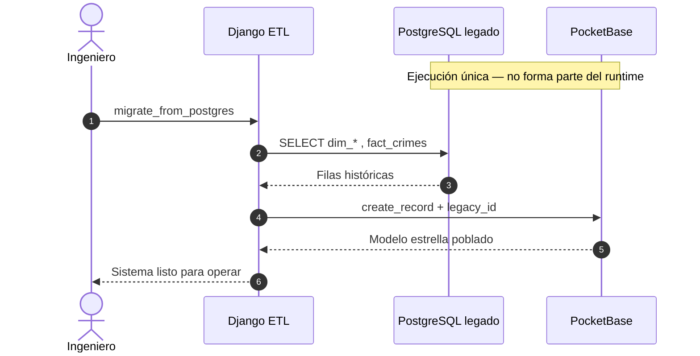

---

## 7.9 Matriz de trazabilidad — requisitos vs vistas UML

| Requisito académico | Vista UML que lo evidencia |
|---------------------|----------------------------|
| Extraer dataset desde PocketBase | SEC-04, actividad §7.7 |
| Convertir a Parquet | SEC-04, componente `export_parquet_to_minio` |
| Cargar Parquet en MinIO | SEC-04, despliegue MinIO §7.6 |
| Tablas hecho y dimensiones | Modelo dominio §7.5, componente PB |
| CRUD hecho y dimensiones | SEC-02, SEC-03, componente React CRUD |
| Docker | Despliegue §7.6, contenedores §7.3 |
| Arquitectura desacoplada | Contenedores §7.3 (sin ORM Postgres en runtime) |

---

## 7.10 Leyenda y convenciones

| Símbolo / término | Significado |
|-------------------|-------------|
| OLTP | Transacciones operativas en PocketBase |
| Data lake | Capa MinIO con Parquet versionable |
| Django API | Único backend de negocio para la SPA |
| PostgreSQL | Sistema externo; solo migración inicial |
| `crimetrack_net` | Red bridge Docker entre PB y MinIO |

**Documentos relacionados:** `06_empresa_mision_vision_objetivos.md`, `08_casos_de_uso_historias.md`, `00_alineacion_requisitos_1-5.md`.
