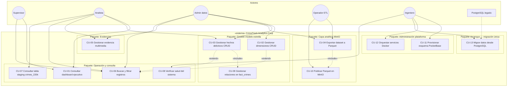

# 8. Casos de uso e historias de usuario — CrimeTrack Analytics Corp

**Sistema:** CrimeTrack Analytics Corp (plataforma completa)  
**Vista UML:** Casos de uso del sistema en operación normal + procesos de soporte (ETL analítico, migración legada)  
**Documento relacionado:** `07_diagramas_uml.md` (componentes, despliegue, secuencias)

---

## 8.1 Actores del sistema


| Actor                             | Descripción                                  | Interacción principal                          |
| --------------------------------- | -------------------------------------------- | ---------------------------------------------- |
| **Supervisor táctico (SUP)**      | Mando medio; prioriza recursos y revisa KPIs | Dashboard, consultas agregadas                 |
| **Analista criminal (AN)**        | Explora hechos, evidencias y patrones        | Dashboard, `fact_crimes`, búsqueda, evidencias |
| **Administrador de datos (AD)**   | Custodia maestros dimensionales y calidad    | CRUD `dim_`*, `fact_crimes`, exportación       |
| **Operador ETL (OET)**            | Mantiene pipeline analítico y respaldos      | `export_parquet_to_minio`, consola MinIO       |
| **Ingeniero de plataforma (ING)** | Despliega y opera infraestructura            | Docker, esquema PB, migración legada           |
| **Sistema programado (SYS)**      | Procesos batch sin usuario en pantalla       | Jobs ETL, healthchecks                         |
| **PostgreSQL legado (EXT)**       | Actor secundario externo                     | Suministra datos solo en migración inicial     |


---

## 8.2 Diagrama general de casos de uso (UML)

Límite del sistema: **CrimeTrack Analytics Corp** (Frontend React + Django API + PocketBase + MinIO + Docker).




### Relaciones UML entre casos de uso


| Relación    | Origen                 | Destino                    | Significado                                                |
| ----------- | ---------------------- | -------------------------- | ---------------------------------------------------------- |
| `«include»` | CU-04 Exportar Parquet | CU-10 Publicar en MinIO    | Toda exportación incluye carga al bucket S3                |
| `«include»` | CU-03 Gestionar hechos | CU-09 Gestionar relaciones | Alta/edición de `fact_crimes` requiere enlazar dimensiones |
| `«extend»`  | CU-06 Buscar/filtrar   | CU-02 / CU-03              | Búsqueda opcional durante gestión de tablas                |


---

## 8.3 Diagrama de casos de uso — capa operativa (PocketBase + Web)

```mermaid
flowchart LR
  subgraph usuarios [Usuarios de negocio]
    SUP((Supervisor))
    AN((Analista))
    AD((Admin))
  end

  subgraph crimetrack [CrimeTrack — Capa operativa]
    UC_DASH[Dashboard KPI y gráficos]
    UC_DIM[CRUD 10 dimensiones]
    UC_FACT[CRUD fact_crimes]
    UC_SEARCH[Búsqueda paginada]
    UC_RAW[Consulta crimes_220k]
    UC_FILE[Evidencias en MinIO vía PB]
  end

  subgraph pb [(PocketBase OLTP)]
    DIMS[dim_*]
    FACT[fact_crimes]
  end

  SUP --> UC_DASH
  AN --> UC_DASH
  AN --> UC_FACT
  AN --> UC_SEARCH
  AN --> UC_RAW
  AN --> UC_FILE
  AD --> UC_DIM
  AD --> UC_FACT
  AD --> UC_SEARCH

  UC_DASH --> pb
  UC_DIM --> DIMS
  UC_FACT --> FACT
  UC_SEARCH --> pb
  UC_RAW --> pb
  UC_FILE --> pb
```


---

## 8.4 Diagrama de casos de uso — capa analítica (MinIO / Parquet)

```mermaid
flowchart LR
  OET((Operador ETL))
  AD((Admin datos))

  subgraph crimetrack [CrimeTrack — Capa analítica]
    UC_EXT[Extraer colecciones PB]
    UC_PARQ[Generar archivos Parquet]
    UC_UP[Subir a MinIO datasets/parquet]
    UC_AUD[Auditar objetos en consola S3]
  end

  subgraph minio [(MinIO Data Lake)]
    LAKE[datasets/parquet/]
    EVID[evidencias / multimedia]
  end

  OET --> UC_EXT
  AD --> UC_EXT
  UC_EXT --> UC_PARQ --> UC_UP --> LAKE
  OET --> UC_AUD
  UC_AUD --> minio
```


---

## 8.5 Especificación de casos de uso (sistema completo)

### CU-01 — Consultar dashboard ejecutivo


| Campo               | Descripción                                                                                                                                                                                                 |
| ------------------- | ----------------------------------------------------------------------------------------------------------------------------------------------------------------------------------------------------------- |
| **Actores**         | SUP, AN                                                                                                                                                                                                     |
| **Descripción**     | El sistema presenta KPIs del modelo estrella, gráfico por dimensiones y últimos hechos delictivos.                                                                                                          |
| **Precondiciones**  | Servicios CrimeTrack desplegados; PocketBase con datos operativos.                                                                                                                                          |
| **Flujo principal** | 1. Actor accede a Overview (`/`). 2. SPA invoca `GET /api/dashboard/stats/`. 3. Django consulta totales y muestras en PocketBase. 4. Se renderizan tarjetas, gráfico de barras y tabla de hechos recientes. |
| **Postcondiciones** | Actor dispone de información actualizada para decisión táctica.                                                                                                                                             |
| **Excepciones**     | 3a. Servicio no disponible → UI muestra alerta y acciones de recuperación (ISO 9241-210).                                                                                                                   |


---

### CU-02 — Gestionar dimensiones (CRUD)


| Campo               | Descripción                                                                                                                                                                                                               |
| ------------------- | ------------------------------------------------------------------------------------------------------------------------------------------------------------------------------------------------------------------------- |
| **Actores**         | AD                                                                                                                                                                                                                        |
| **Descripción**     | Mantenimiento de las diez dimensiones del modelo estrella en PocketBase vía interfaz web.                                                                                                                                 |
| **Precondiciones**  | Colecciones `dim_`* provisionadas; usuario con acceso a la aplicación.                                                                                                                                                    |
| **Flujo principal** | 1. Actor selecciona dimensión en menú lateral. 2. Sistema lista registros paginados. 3. Actor crea, edita o elimina mediante formularios modales. 4. Django sincroniza con PocketBase. 5. Tabla refleja el estado actual. |
| **Postcondiciones** | Maestro dimensional consistente en capa OLTP.                                                                                                                                                                             |
| **Excepciones**     | 4a. Regla de validación PocketBase → mensaje de error en formulario.                                                                                                                                                      |


**Dimensiones incluidas:** `dim_actualizacion`, `dim_area_administrativa`, `dim_arresto`, `dim_caso`, `dim_distrito_policial`, `dim_tiempo`, `dim_tipo_crimen`, `dim_ubicacion_geografica`, `dim_ubicacion_lugar`, `dim_violencia_domestica`.

---

### CU-03 — Gestionar hechos delictivos (CRUD)


| Campo               | Descripción                                                                                                                                                                                                                  |
| ------------------- | ---------------------------------------------------------------------------------------------------------------------------------------------------------------------------------------------------------------------------- |
| **Actores**         | AD, AN                                                                                                                                                                                                                       |
| **Descripción**     | Gestión de la tabla de hechos `fact_crimes` con enlaces a todas las dimensiones.                                                                                                                                             |
| **Precondiciones**  | Dimensiones referenciadas existentes; relaciones configuradas en PocketBase.                                                                                                                                                 |
| **Flujo principal** | 1. Actor abre módulo Hechos delictivos. 2. Sistema lista hechos con dimensiones expandidas. 3. Actor registra o modifica hecho seleccionando relaciones (caso, tipo, distrito, tiempo, etc.). 4. Persistencia en PocketBase. |
| **Postcondiciones** | Registro en `fact_crimes` integrado al modelo estrella.                                                                                                                                                                      |
| **Incluye**         | CU-09 Gestionar relaciones en fact_crimes                                                                                                                                                                                    |


---

### CU-04 — Exportar dataset a Parquet


| Campo               | Descripción                                                                                                                                                      |
| ------------------- | ---------------------------------------------------------------------------------------------------------------------------------------------------------------- |
| **Actores**         | AD, OET, SYS                                                                                                                                                     |
| **Descripción**     | Extracción masiva de colecciones operativas desde PocketBase y materialización en formato columnar Parquet.                                                      |
| **Precondiciones**  | PocketBase accesible; librerías ETL en entorno Django.                                                                                                           |
| **Flujo principal** | 1. Operador ejecuta `export_parquet_to_minio`. 2. Sistema pagina registros de cada `dim_`* y `fact_crimes`. 3. Genera `{coleccion}.parquet` comprimido (Snappy). |
| **Postcondiciones** | Dataset analítico listo para publicación.                                                                                                                        |
| **Incluye**         | CU-10 Publicar Parquet en MinIO                                                                                                                                  |


---

### CU-05 — Gestionar evidencia multimedia


| Campo               | Descripción                                                                                                                                                       |
| ------------------- | ----------------------------------------------------------------------------------------------------------------------------------------------------------------- |
| **Actores**         | AN, AD                                                                                                                                                            |
| **Descripción**     | Asociación de imágenes, PDF y multimedia a registros mediante almacenamiento S3 en MinIO.                                                                         |
| **Precondiciones**  | PocketBase configurado con backend S3 hacia MinIO (`http://minio:9000`).                                                                                          |
| **Flujo principal** | 1. Actor adjunta archivo en registro con campo File. 2. PocketBase almacena objeto en bucket de evidencias. 3. Sistema mantiene referencia en registro operativo. |
| **Postcondiciones** | Evidencia disponible y trazable en MinIO.                                                                                                                         |


---

### CU-06 — Buscar y filtrar registros


| Campo               | Descripción                                                                                                                                                 |
| ------------------- | ----------------------------------------------------------------------------------------------------------------------------------------------------------- |
| **Actores**         | AN, AD, SUP                                                                                                                                                 |
| **Descripción**     | Búsqueda textual y paginación sobre cualquier colección expuesta en la SPA.                                                                                 |
| **Precondiciones**  | Módulo CRUD de la colección activo.                                                                                                                         |
| **Flujo principal** | 1. Actor ingresa criterio en campo buscar. 2. SPA solicita listado filtrado a Django. 3. Django aplica filtro PocketBase. 4. Resultados paginados en tabla. |
| **Postcondiciones** | Subconjunto de registros acotado para análisis operativo.                                                                                                   |
| **Extiende**        | CU-02, CU-03                                                                                                                                                |


---

### CU-07 — Consultar tabla staging crimes_220k


| Campo               | Descripción                                                                                                          |
| ------------------- | -------------------------------------------------------------------------------------------------------------------- |
| **Actores**         | AN, AD                                                                                                               |
| **Descripción**     | Consulta de la vista plana histórica (~220k filas) para auditoría o cruce sin joins.                                 |
| **Precondiciones**  | Colección `crimes_220k` poblada en PocketBase.                                                                       |
| **Flujo principal** | 1. Actor abre módulo Crímenes raw. 2. Sistema pagina registros (25 por página). 3. Actor navega y busca según CU-06. |
| **Postcondiciones** | Acceso de lectura al staging sin alterar modelo estrella.                                                            |


---

### CU-08 — Verificar salud del sistema


| Campo               | Descripción                                                                                                |
| ------------------- | ---------------------------------------------------------------------------------------------------------- |
| **Actores**         | ING, SYS                                                                                                   |
| **Descripción**     | Comprobación de disponibilidad de Django y PocketBase.                                                     |
| **Precondiciones**  | Endpoints de red accesibles.                                                                               |
| **Flujo principal** | 1. Monitor o ingeniero invoca `GET /api/health/`. 2. Sistema valida PocketBase y responde estado agregado. |
| **Postcondiciones** | Estado conocido para operación o escalado.                                                                 |


---

### CU-09 — Gestionar relaciones en fact_crimes


| Campo               | Descripción                                                                                                                                                                           |
| ------------------- | ------------------------------------------------------------------------------------------------------------------------------------------------------------------------------------- |
| **Actores**         | AD, AN (incluido en CU-03)                                                                                                                                                            |
| **Descripción**     | Resolución de claves foráneas lógicas hacia registros de dimensiones al persistir un hecho.                                                                                           |
| **Flujo principal** | 1. Formulario carga opciones vía `GET /api/collections/{dim}/options/`. 2. Actor selecciona caso, tipo, distrito, tiempo, etc. 3. IDs PocketBase se envían en cuerpo de alta/edición. |


---

### CU-10 — Publicar Parquet en MinIO


| Campo               | Descripción                                                                            |
| ------------------- | -------------------------------------------------------------------------------------- |
| **Actores**         | OET, SYS (incluido en CU-04)                                                           |
| **Descripción**     | Carga de archivos Parquet al data lake institucional bajo prefijo `datasets/parquet/`. |
| **Postcondiciones** | Objetos S3 disponibles para BI, respaldo y analítica batch.                            |


---

### CU-11 — Provisionar esquema PocketBase


| Campo               | Descripción                                                                                                      |
| ------------------- | ---------------------------------------------------------------------------------------------------------------- |
| **Actores**         | ING                                                                                                              |
| **Descripción**     | Creación idempotente de colecciones `dim_`*, `fact_crimes` y `crimes_220k` con metadatos de campos y relaciones. |
| **Flujo principal** | 1. Ingeniero ejecuta `setup_pocketbase_schema`. 2. Sistema crea colecciones faltantes vía API admin.             |


---

### CU-12 — Orquestar servicios Docker


| Campo               | Descripción                                                                                     |
| ------------------- | ----------------------------------------------------------------------------------------------- |
| **Actores**         | ING                                                                                             |
| **Descripción**     | Despliegue de MinIO y PocketBase en red `crimetrack_net` mediante Docker Compose.               |
| **Flujo principal** | 1. `docker compose up -d` en `infra/`. 2. Contenedores healthy; volúmenes persistentes activos. |


---

### CU-13 — Migrar datos desde PostgreSQL (arranque)


| Campo                | Descripción                                                                                                            |
| -------------------- | ---------------------------------------------------------------------------------------------------------------------- |
| **Actores**          | ING                                                                                                                    |
| **Actor secundario** | PostgreSQL legado (EXT)                                                                                                |
| **Descripción**      | Carga inicial única del warehouse histórico hacia PocketBase; **no forma parte del runtime** del sistema en operación. |
| **Precondiciones**   | PostgreSQL accesible con modelo estrella; PocketBase provisionado.                                                     |
| **Flujo principal**  | 1. `migrate_from_postgres --steps dims`. 2. `--steps facts`. 3. Opcional `--steps raw`. 4. Validación de conteos.      |
| **Postcondiciones**  | CrimeTrack operativo sin dependencia de PostgreSQL.                                                                    |


---

## 8.6 Historias de usuario (7) — sistema implementado

Cada historia describe capacidad **entregada** por CrimeTrack Analytics Corp, con criterios de aceptación verificables.

### HU-01 — Dashboard ejecutivo para decisión táctica

**Como** supervisor táctico, **quiero** un panel Overview con KPIs y distribución por dimensiones, **para** priorizar recursos en menos de un minuto.

**Criterios de aceptación:**

- El sistema expone Overview en la ruta raíz de la SPA.
- Se visualizan totales de `fact_crimes`, casos, tipos de crimen y staging raw.
- Gráfico de barras refleja conteos por dimensión desde PocketBase.
- Tabla de últimos hechos muestra tipo y distrito expandidos.
- Ante fallo de backend, la UI informa el error sin dejar pantalla vacía.

**Casos de uso:** CU-01

---

### HU-02 — Mantenimiento de maestros dimensionales

**Como** administrador de datos, **quiero** CRUD sobre las diez dimensiones del modelo estrella, **para** garantizar integridad referencial de los hechos.

**Criterios de aceptación:**

- Menú lateral lista las 10 dimensiones bajo grupo «Dimensiones».
- Listado paginado con contador de registros alineado a PocketBase.
- Alta, edición y baja con modales etiquetados (ISO 9241-210).
- Campo `legacy_id` preservado cuando aplica trazabilidad Postgres.

**Casos de uso:** CU-02, CU-06

---

### HU-03 — Registro de hechos con modelo estrella

**Como** analista criminal, **quiero** registrar hechos enlazando caso, tipo, ubicación, distrito y tiempo, **para** analizar incidentes de forma normalizada.

**Criterios de aceptación:**

- Módulo `fact_crimes` disponible en menú «Hechos / Raw».
- Formulario ofrece selects de relaciones cargados desde API.
- Listado muestra dimensiones expandidas legibles.
- Persistencia exitosa reflejada sin recargar manualmente el navegador.

**Casos de uso:** CU-03, CU-09

---

### HU-04 — Pipeline analítico PocketBase → Parquet → MinIO

**Como** operador ETL, **quiero** publicar snapshots columnares en MinIO, **para** alimentar analítica avanzada y respaldos inmutables.

**Criterios de aceptación:**

- Comando `export_parquet_to_minio` extrae `dim_`* y `fact_crimes`.
- Cada colección genera un archivo `.parquet` válido.
- Objetos quedan en `s3://crimetrack-evidence/datasets/parquet/`.
- Log del sistema reporta filas exportadas por colección.

**Casos de uso:** CU-04, CU-10

---

### HU-05 — Evidencias multimedia en MinIO

**Como** analista, **quiero** asociar archivos a registros, **para** soportar investigaciones con material probatorio.

**Criterios de aceptación:**

- PocketBase persiste archivos en MinIO vía S3.
- Objetos visibles en consola MinIO bajo bucket de evidencias.
- Registro operativo conserva referencia al archivo.

**Casos de uso:** CU-05

---

### HU-06 — Búsqueda operativa transversal

**Como** analista, **quiero** buscar en tablas operativas, **para** localizar casos o distritos sin consultas SQL manuales.

**Criterios de aceptación:**

- Campo de búsqueda disponible en vistas CRUD.
- Resultados filtrados vía API Django hacia PocketBase.
- Paginación coherente tras aplicar filtro.
- Reinicio a página 1 al cambiar criterio de búsqueda.

**Casos de uso:** CU-06

---

### HU-07 — Operación desacoplada de PostgreSQL

**Como** auditor de arquitectura, **quiero** que CrimeTrack opere sin PostgreSQL en producción, **para** validar el diseño exigido en Construcción de Software.

**Criterios de aceptación:**

- Runtime del sistema: React → Django → PocketBase / MinIO únicamente.
- Django usa SQLite solo para metadatos internos.
- CRUD, dashboard y ETL Parquet funcionan con PostgreSQL detenido.
- Migración desde PostgreSQL documentada como proceso de arranque (CU-13).

**Casos de uso:** CU-13 (histórico), CU-01 a CU-12 (operación)

---

## 8.7 Matriz de trazabilidad — requisitos académicos


| Requisito                  | Diagrama / casos de uso             | Historias    |
| -------------------------- | ----------------------------------- | ------------ |
| 1 Extraer desde PocketBase | CU-04, diagrama capa analítica §8.4 | HU-04        |
| 2 Convertir a Parquet      | CU-04                               | HU-04        |
| 3 Cargar Parquet en MinIO  | CU-10, §8.4                         | HU-04        |
| 4 Hecho + dimensiones      | CU-02, CU-03, §8.3, doc 07 §7.5     | HU-02, HU-03 |
| 5 CRUD                     | CU-02, CU-03, §8.3                  | HU-02, HU-03 |
| 6 Empresa / OE             | —                                   | Doc 06       |
| 7 UML técnico              | —                                   | Doc 07       |
| 8 Casos de uso / HU        | §8.2–8.6                            | §8.6         |


---

## 8.8 Resumen para el informe

CrimeTrack Analytics Corp expone **13 casos de uso** agrupados en operación, modelo estrella, evidencias, analítica MinIO y administración de plataforma, más **migración legada** como proceso de arranque. Los **7 casos de uso principales** solicitados por el docente se cubren con CU-01 a CU-07; el diagrama general (§8.2) sitúa el **sistema completo**, no un prototipo parcial.